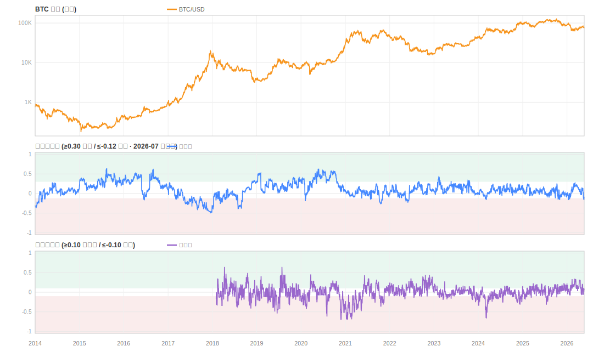
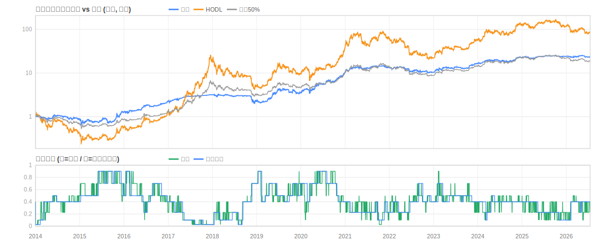

# BTC Compass 双评分历史回测报告

生成时间: 2026-07-08 10:05
回测窗口: 周期分 2014-01-01 → 2026-05-23 (4526 天) | 战术分 2018-02-01 → 2026-05-23 (3034 天)

## ⚠️ 方法论与局限 (先读这个)

1. **样本内偏差**: 各因子的打分阈值 (如 NUPL>0.75 兴奋区) 本身参考了历史周期制定,
   本回测是"设计一致性验证", **不是样本外证明**。阈值与回测共用同一段历史。
2. **缺失因子**: 期货基差 (历史不可免费获得)、多空比 (交易所仅留 30 天) 在全程缺失,
   缺失因子按现网同一套"剔除重归一"机制处理。
   交易所余额为 v2 口径 (CoinMetrics 30日存量变化, 2026-06 上线), 与现网一致。
3. **数据源差异**: 资金费率用 Binance (现网 OKX)、MVRV-Z/NUPL/Puell 由 CoinMetrics
   MVRV 反推 (校准结果见运行日志)、RSI/MACD 回测仅 日/周/月 三腿 (现网另含 OKX 真实 4H/12H)。
4. **前瞻收益样本重叠**: 长窗口 (180/365d) 相邻样本高度重叠, 有效样本数远小于表中天数,
   档位均值的统计显著性有限。
5. 价格为 CoinMetrics UTC 收盘参考价; 策略未计交易成本 (换手率见下)。
6. **2026-07 对抗性审查后的口径**: ① RSI 移除伪 4H/12H 切片与年线腿 (旧版日线三重计票);
   ② Pi Cycle 改 {0,-0.5,-1} 顶部探测器编码 (旧版把"远离交叉"当 +1 看多);
   ③ MVRV-Z/NUPL/Puell 改为 4 年分位数为主 + 绝对阈值极值保底 (修复周期振幅衰减)。
   本报告为新口径下的重跑结果, 与 2026-06 版报告数字不可直接对比。

## 因子覆盖范围

### 周期分
| factor | first | last | days |
|---|---|---|---|
| Mayer Multiple | 2012-02-01 | 2026-05-23 | 5226 |
| 200-Week Heatmap | 2015-05-16 | 2026-05-23 | 4026 |
| 幂律走廊 | 2011-07-17 | 2026-05-23 | 5425 |
| Ahr999 | 2012-02-01 | 2026-05-23 | 5226 |
| Pi Cycle Top | 2011-07-02 | 2026-05-23 | 5440 |
| MVRV-Z | 2011-07-17 | 2026-05-23 | 5425 |
| STH成本线 | 2022-07-03 | 2026-05-23 | 1421 |
| NUPL | 2010-07-18 | 2026-05-23 | 5789 |
| 交易所余额 | 2011-05-24 | 2026-05-23 | 5479 |
| ETF净流入 | 2025-04-30 | 2026-05-23 | 389 |
| 稳定币增速 | 2017-12-29 | 2026-05-23 | 3068 |
| 趋势过滤器 | 2011-03-04 | 2026-05-23 | 5560 |
| Puell Multiple | 2011-07-17 | 2026-05-23 | 5425 |
| Hash Ribbons | 2010-09-15 | 2026-05-23 | 5730 |
| 减半周期 | 2010-07-18 | 2026-05-23 | 5789 |

### 战术分
| factor | first | last | days |
|---|---|---|---|
| 资金费率(7d) | 2019-09-17 | 2026-05-23 | 2441 |
| MACD | 2017-06-01 | 2026-05-23 | 3279 |
| RSI(14) | 2017-06-01 | 2026-05-23 | 3279 |
| SOPR | 2022-07-03 | 2026-05-23 | 1421 |
| 布林带 | 2010-08-06 | 2026-05-23 | 5770 |
| 恐惧贪婪指数 | 2018-02-01 | 2026-05-23 | 3030 |
| 交易所净流(7d) | 2011-04-30 | 2026-05-23 | 5503 |

## 周期分: 分档前瞻收益

| 档位 | 窗口 | 样本数 | 均值% | 中位数% | 胜率% |
|---|---|---|---|---|---|
| 重仓区 80-100% | 30d | 141 | +13.5 | +7.9 | +75.9 |
| 偏多配置 60-80% | 30d | 525 | +9.6 | +8.2 | +76.2 |
| 标准配置 40-60% | 30d | 1385 | +7.7 | +4.8 | +61.7 |
| 中性观望 30-50% | 30d | 1475 | +1.4 | -1.6 | +45.6 |
| 减配 15-30% | 30d | 531 | +1.7 | -1.8 | +46.1 |
| 低配 5-15% | 30d | 295 | +4.8 | -4.1 | +41.7 |
| 防守区 0-5% | 30d | 144 | +15.1 | -0.4 | +49.3 |
| 重仓区 80-100% | 90d | 141 | +67.1 | +29.4 | +100.0 |
| 偏多配置 60-80% | 90d | 511 | +38.7 | +29.8 | +89.2 |
| 标准配置 40-60% | 90d | 1350 | +17.8 | +7.6 | +60.0 |
| 中性观望 30-50% | 90d | 1464 | +7.8 | -1.1 | +48.4 |
| 减配 15-30% | 90d | 531 | +6.9 | -7.5 | +38.0 |
| 低配 5-15% | 90d | 295 | +47.8 | +2.0 | +50.5 |
| 防守区 0-5% | 90d | 144 | +17.7 | -2.7 | +46.5 |
| 重仓区 80-100% | 180d | 141 | +249.0 | +237.1 | +100.0 |
| 偏多配置 60-80% | 180d | 511 | +84.0 | +63.7 | +92.6 |
| 标准配置 40-60% | 180d | 1348 | +36.9 | +32.3 | +72.1 |
| 中性观望 30-50% | 180d | 1421 | +20.5 | -3.2 | +48.1 |
| 减配 15-30% | 180d | 490 | +23.7 | -16.9 | +35.9 |
| 低配 5-15% | 180d | 291 | +124.0 | +40.4 | +59.8 |
| 防守区 0-5% | 180d | 144 | -1.2 | -30.4 | +35.4 |
| 重仓区 80-100% | 365d | 141 | +340.4 | +309.9 | +100.0 |
| 偏多配置 60-80% | 365d | 510 | +233.9 | +153.1 | +91.4 |
| 标准配置 40-60% | 365d | 1274 | +161.3 | +85.7 | +76.2 |
| 中性观望 30-50% | 365d | 1350 | +91.8 | +33.8 | +63.3 |
| 减配 15-30% | 365d | 452 | +86.4 | -1.3 | +49.3 |
| 低配 5-15% | 365d | 290 | +104.1 | +55.6 | +64.5 |
| 防守区 0-5% | 365d | 144 | -12.1 | -13.7 | +43.1 |

### 评分-收益秩相关 IC (Spearman, 期望为正)

| 窗口 | IC | 样本数 |
|---|---|---|
| 30d | +0.210 | 4496 |
| 90d | +0.244 | 4436 |
| 180d | +0.343 | 4346 |
| 365d | +0.359 | 4161 |

## 战术分: 分档前瞻收益

| 档位 | 窗口 | 样本数 | 均值% | 中位数% | 胜率% |
|---|---|---|---|---|---|
| 入场窗口 (≥0.25) | 7d | 164 | +2.1 | +0.6 | +56.1 |
| 逢低分批 (0.1~0.25) | 7d | 634 | +1.2 | +1.0 | +55.4 |
| 等待信号 (-0.1~0.1) | 7d | 1485 | +0.7 | +0.3 | +51.9 |
| 谨慎 (-0.35~-0.1) | 7d | 597 | +0.4 | -0.0 | +49.9 |
| 杠杆拥挤 (<-0.35) | 7d | 147 | +2.0 | +0.6 | +52.4 |
| 入场窗口 (≥0.25) | 14d | 164 | +3.9 | +1.8 | +59.8 |
| 逢低分批 (0.1~0.25) | 14d | 632 | +2.8 | +1.5 | +55.9 |
| 等待信号 (-0.1~0.1) | 14d | 1480 | +1.5 | +0.8 | +53.3 |
| 谨慎 (-0.35~-0.1) | 14d | 597 | +0.7 | +0.0 | +50.3 |
| 杠杆拥挤 (<-0.35) | 14d | 147 | +4.3 | +1.5 | +52.4 |
| 入场窗口 (≥0.25) | 30d | 164 | +3.6 | +2.5 | +64.0 |
| 逢低分批 (0.1~0.25) | 30d | 625 | +5.5 | +3.1 | +58.6 |
| 等待信号 (-0.1~0.1) | 30d | 1471 | +3.3 | +0.9 | +51.9 |
| 谨慎 (-0.35~-0.1) | 30d | 597 | +2.7 | -1.2 | +46.7 |
| 杠杆拥挤 (<-0.35) | 30d | 147 | +10.6 | +10.1 | +66.0 |

### 评分-收益秩相关 IC

| 窗口 | IC | 样本数 |
|---|---|---|
| 7d | +0.052 | 3027 |
| 14d | +0.081 | 3020 |
| 30d | +0.056 | 3004 |

## 周期分档位仓位策略 (次日生效, 无成本)

平均仓位 43% | 累计换手 118.0x

| 组合 | 总收益% | CAGR% | 年化波动% | Sharpe | 最大回撤% |
|---|---|---|---|---|---|
| 策略 | +2108.68 | +28.38 | +28.83 | +1.01 | -46.40 |
| HODL | +10083.33 | +45.24 | +67.61 | +0.89 | -83.78 |
| 恒定50% | +1966.82 | +27.69 | +33.81 | +0.89 | -55.89 |

## 决策层: 滞回换档 (2026-07 新增, 现网决策面板同款规则)

规则: 周期分须越过当前档位边界 ±0.05 且新档位连续 5 天保持才换档。
两行均计单边 10bp 交易成本。基线逐日换档 12 年换 787 次
(边界附近日频往返, 决策不可执行); 滞回后 89 次。
参数取自 δ∈[0.03,0.06]×N∈[3,7] 网格平台中部 — 全网格 Sharpe 均 ≥ 基线,
非单点调优; 代价是减仓延迟, 最大回撤略深 (约 -46.6%→-48.4%)。

| 策略 | 总收益% | CAGR% | 年化波动% | Sharpe | 最大回撤% | 换手x | 年均换档 |
|---|---|---|---|---|---|---|---|
| 基线(逐日换档) | +1862.81 | +27.16 | +28.83 | +0.98 | -46.57 | +118.00 | +63.50 |
| 滞回(δ=0.05,N=5天) | +2488.65 | +30.04 | +27.98 | +1.08 | -48.40 | +16.20 | +7.20 |

## 补充发现 (2026-06 静态结论 + 2026-07 对抗性审查后更新)

1. **档位阈值已重标定 (2026-07 落地)**: 桶平均机制把量程压缩到约 [-0.5, +0.68],
   旧斐波那契阈值 (±0.618/±0.382) 极值档 12 年触发 <1%。现按 2014+ 评分分布分位数
   重标定为 0.45/0.30/0.15/0.00/-0.12/-0.30 (目标频率 3/12/30/28/17/7/3%);
   战术分同理重标定为 0.25/0.10/-0.10/-0.35。阈值与分布同源, 属样本内标定 (见局限1)。
2. **交易所余额 v2 (已上线)**: 旧版冷钱包快照对比 94.5% 时间打 0 分;
   新版 CoinMetrics 30日存量变化分位数打分, 上线后周期分各窗口 IC 提升 +0.02 左右。
3. **交易所净流 7d (2026-06 已接入)**: 新建"链上资金流"桶 15%
   (杠杆 40→35 / 动量 35→30 / 情绪 25→20)。单因子 7-14d IC +0.10~+0.13。
4. **战术分**: "杠杆拥挤"档 (旧称"高危时段") 30d 前瞻收益为正 — 逆向过热信号
   在主升段提前触发, 负分只约束"别加杠杆追高", 不构成现货卖出信号 (文案已如实标注);
   含基差/多空比的完整配置仍无法回测检验。
5. **2026-07 编码修复对 IC 的影响**: Pi Cycle 去掉常驻 +1、链上桶分位数化后,
   周期分 IC 全窗口回落 (365d 0.475→0.36) — 旧 IC 中有一部分来自
   "无信号=看多"编码搭上 BTC 长期上行漂移的样本内红利, 属虚高;
   新口径最大回撤改善 (-49%→-45%), Sharpe 基本持平, 熊市中段不再出现满分看多票。

